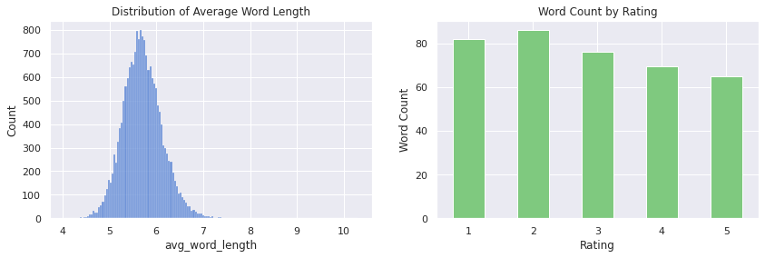
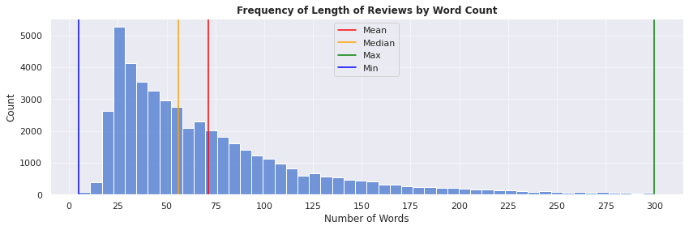
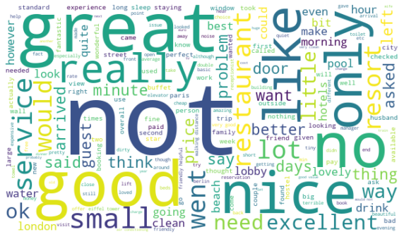
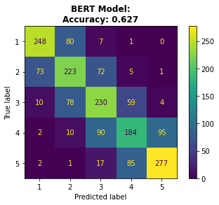
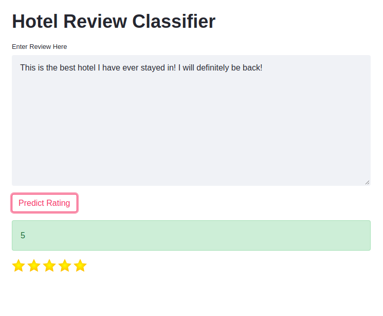

# NLP Review Classifier

## Overview 

**Problem Statement**

Today, reviews form a big part of society and many people rely heavily on them when making decisions about purchasing goods and services. Reviews not only help to inform people but they can also be extremely useful for identifying where businesses need to improve. Because of this, businesses often encourage people to leave reviews and ratings of their products or services. 

While many people do leave reviews and ratings, many others share their thoughts and feelings about particular goods and services in a variety of different public places, such as forums, blogs or even through social media channels.

Given the usefulness of this feedback, it could be beneficial for a business to develop a methodology to find these reviews and attempt to estimate what rating that person would have given for the good or service that they received. 

Processing textual information like this could give businesses a more comprehensive understanding of how their products and services are perceived by consumers which could help them make critical business decisions.

In this project, I focused on reviews of hotels by using data from the popular travel booking site TripAdvisor.

---

**Obtaining the Reviews**

- While I was able to find some existing review data from TripAdvisor on Kaggle, the data was heavily imbalanced in favour of higher ratings. Because of this, I built a script using BeautifulSoup and Selenium to scrape reviews from the TripAdvisor website. When looking for hotels to scrape, I focused on big capital cities that usually have a lot of hotel guests throughout the year. I picked London, Paris and Berlin and tried to find hotels that had a good mix of positive and negative reviews. Despite this, most of the ratings for the majority of hotels were either a 4 or 5. In total, I scraped reviews from 33 hotels, 11 from each city.

**Splitting the Notebooks**

- Given the computational resources required for training, much of the model building in this project was carried out on Google Colab.

To view all of the notebooks in nbviewer, click the following links:

[**Notebook 1: Data Cleaning & EDA**](https://nbviewer.jupyter.org/github/dan-grant-hunter/NLP_Review_Classifier/blob/main/1_NLP_Data_Cleaning_and_EDA.ipynb)

[**Notebook 2: Initial Model Building**](https://nbviewer.jupyter.org/github/dan-grant-hunter/NLP_Review_Classifier/blob/main/2_NLP_Initial_Model_Building.ipynb)

[**Notebook 3: Neural Network & Pretrained Model Building**](https://nbviewer.jupyter.org/github/dan-grant-hunter/NLP_Review_Classifier/blob/main/3_NLP_Neural_Network_%26_Pretrained_Modelling.ipynb)

## Summary Statistics of Models

| Models | Precision | F1-Score | Accuracy |
| :- | :-: | :-: | :-: |
| DecisionTreeClassifier | 0.38 | 0.38 | 0.394 |
| LinearSVC | 0.554 | 0.553 | 0.568 |
| MultinomialNB | 0.563 | 0.564 | 0.567 |
| LogisticRegression | 0.571 | 0.573 | 0.578 |
| KNeighborsClassifier | 0.418 | 0.419 | 0.431 |
| RandomForestClassifier | 0.508 | 0.482 | 0.518 |
| RidgeClassifier | 0.552 | 0.554 | 0.565 |
| SGDClassifier | 0.569 | 0.57 | 0.58 |
| LGBMClassifier | 0.544 | 0.546 | 0.551 |
| AdaBoostClassifier | 0.513 | 0.483 | 0.522 |
| VotingClassifier | 0.572 | 0.574 | 0.582 |
| StackingClassifier | 0.59 | 0.593 | 0.599 |
| Neural Network - Dense | - | - | 0.587 |
| Neural Network - Embedding | - | - | 0.59 |
| Neural Network - Convolutional | - | - | 0.552 |
| **BERT** | - | - | **0.627** |

## Code and Resources Used 
**Python Version:** 3.8.5  
**Packages:** pandas, numpy, matplotlib, seaborn, worcloud, nltk, scikit-learn, lightgbm, keras, ktrain, streamlit

## EDA

Below are a few highlights from the analysis. 

#### Average word length and word count by rating

  

#### Length of reviews by word count

  

#### Wordcloud 

  

#### BERT confusion matrix with accuracy

 

## Model Deployment

After finding a model that performed reasonably well and wasn't too big in size, I deployed it as an app using Streamlit and Heroku. The app, which allows users to enter a review and receive a predicted rating for it, can be found at the link below:

[**Hotel Review Classifier App**](https://nlp-review-classifier.herokuapp.com/)

High Rating | Low Rating
:----------------:|:----------------:
  |  

## Future Development

NLP is a massive field in machine learning and there are so many different methods for extracting meaning from text. In this project, we only scratched the surface of what is possible. This field is rapidly evolving with new algorithms and methods frequently being developed and introduced. Given more time, here are a few things we could do if we were to develop this project even further:

* **Increase the amount of data** - While we did collect quite a bit of data in this project, much of it was of higher ratings and thus we had to eliminate a lot of it in order to balance the classes. In future we could collect more data whilst trying to focus on getting reviews with lower ratings. Alternatively, we could use a data augmentation technique whereby we translate the reviews to other languages and then back to English again. The discrepancy in the translation process  would ensure that the review is different but similar enough that it would keep its underlying sentiment.  
* **Spend more time cleaning the data** - For our reviews, we did some basic cleaning and lemmatization. This might have meant that some words remained in our reviews that should have been removed. For example, as we split on spaces to perform our cleaning, two words joined by mistake would have stayed as a single token. We also opted not to use stemming but we could incorporate this in the future to see if it would offer any benefit.   
* **Vectorize our reviews differently** - In the initial modelling phase (notebook #2), we vectorized our reviews using TF-IDF (Term Frequency - Inverse Document Frequency) however there are many other methods we could have used. It would be worth seeing if any of these other methods improve the models or not.  
* **Use pre-trained word embeddings** - Rather than vectorize our reviews based on our own data, we could use pre-trained word embeddings such as those from Word2Vec, Doc2Vec or GloVe. These embeddings have been created by training models on huge corpora and could be an interesting area to explore in the future.  
* **Use different neural network architectures and pre-trained models** - In this project, we tried out only a few simple neural network architectures however we could have developed models that were much more complex. We also used only one pre-trained model, BERT, however there are many different models and transformers that could be explored to see if they perform better.
